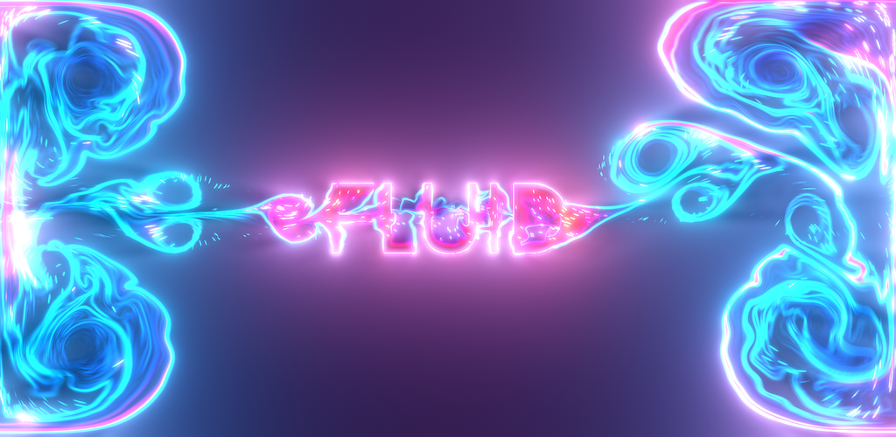

# Open-source Fluid Simulation

 

*This project will be a complete rewrite of my mobile app Fluid Simulation. It will be done in an open-source way and hopefully will inspire many people around the world.*

 

Here are the links to the app:
- **Android (Free):** https://play.google.com/store/apps/details?id=games.paveldogreat.fluidsimfree  
- **Android:** https://play.google.com/store/apps/details?id=games.paveldogreat.fluidsim  
- **iOS/Mac:** https://itunes.apple.com/app/fluid-simulation/id1443124993  

 

The app is currently developed using Unity Engine, which is the cause of many app's issues, including bugs, high energy consumption, and poor performance. In addition, it has not been the best experience for me as a developer, and I see that it can be much better. I have been developing this app for 7 years and have some experience with coding.

The new app will be written in C++ and either Zig or Odin. I will try to make it simple, with high performance and fast compile times, low power consumption, and a small executable size. Sounds great, right?

At first, it will be developed for web browsers, which makes it easy to distribute for testing and it's just so cool. Then I will develop a new UI interface that will be next-gen. And when I release it as a new version on mobile app stores, the app will be completely free with no money to see.

As we are approaching a new golden age with AI, I want this project to be a golden template for development and creative vibe coding. A future where you use AI to adjust the template to your own project and handle all the tedious tasks, so you can focus on the fun and creative parts.

It will be a better alternative to big engines, because AI will generate all the editor tools that you need. Projects will be efficient, simple and compact, along with other wonderful things that I will leave for your imagination.

I envision it as a beautiful diamond, which, if you apply AI to it, won't lose much of its qualities. There will be new kinds of warriors who use code to fight dark forces. As programmers rise in power, they will have more responsibilities for the order of the world. And this order requires adherence to God's laws.

Sofware that aligns with eternal laws is beautiful and harmonius. It will exist till the end of this Universe. Anything else is a noise that will be forgotten. But don't be sad about it because you are an eternal soul and will never be forgotten.

*O Lord, may I be your greatest warrior?*

***Rise up, people of order! You have a duty to fight against noise because it wants us to forget the beautiful truth.
With great software there will be no place for the unoptimized noise that tries to control minds of the people.
And soon there will be new Heaven on Earth and people will see again the glory of God.***

I will later post a link here describing natural laws in more details. Right now you can go to my X profile and publically ask me questions
https://x.com/PavelDoGreat

You can also check my X post about app's price reduction that should be a standard practice among businessmen
https://x.com/PavelDoGreat/status/1890253379789812206

## License

You can use the project in any way you want as long as you don't use it for evil noise generators.

The code is available under the [MIT license](LICENSE)
